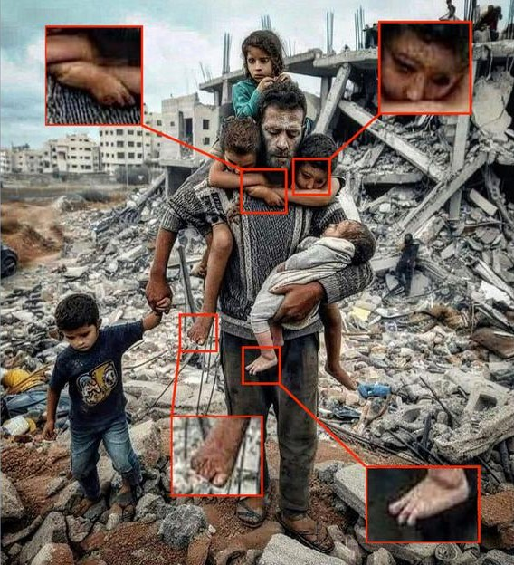

+++
title = "Kritisches Denken in der digitalen Ära"
date = "2023-12-17"
draft = false
pinned = false
tags = ["Deutsch", "kritischesDenken"]
image = "desinforamtion-bild.webp"
description = "Kritisches Denken ist zweifellos eine Schlüsselfähigkeit im 21. Jahrhundert. In diesem Blog werde ich sowohl den theoretischen Hintergrund als auch die praktische Anwendung des kritischen Denkens beleuchten, um zu verdeutlichen, warum diese Fähigkeit in der Ära der Digitalisierung, künstlichen Intelligenz und manipulativen Medienkonzernen von entscheidender Bedeutung ist."
footnotes = "Titelbild Quelle: https://www.shutterstock.com/de/search/desinformation"
+++
Kritisches Denken ist zweifellos eine Schlüsselfähigkeit im 21. Jahrhundert. In diesem Blog werde ich sowohl den theoretischen Hintergrund als auch die praktische Anwendung des kritischen Denkens beleuchten, um zu verdeutlichen, warum diese Fähigkeit in der Ära der Digitalisierung, künstlichen Intelligenz und manipulativen Medienkonzernen von entscheidender Bedeutung ist.

### **Was ist kritisches Denken?**

Als allererstes müssen wir klären, was genau unter kritischem Denken zu verstehen ist. Kritisches Denken bedeutet in erster Linie, logische Fehler beim Aufnehmen und Verarbeiten von Informationen zu erkennen und zu vermeiden. Das impliziert ein Bewusstsein für die Entstehung von logischen Fehlschlüssen und kognitiven Verzerrungen.



Logische Fehlschlüsse beziehen sich auf Fehler im Aufbau eines Arguments, bei dem die Überleitung von der Behauptung oder Prämisse nicht korrekt zur behaupteten Schlussfolgerung führt. Es gibt zahlreiche Arten von Fehlschlüssen, von persönlichen Angriffen bis hin zur falschen Annahme, dass Korrelation gleich Kausalität sei. Ein Beispiel hierfür wäre die Annahme, dass der Anstieg des Glace-Verkaufs im Sommer zu mehr Sonnenbränden führt, was lediglich eine Korrelation darstellt, ohne dass ein kausaler Zusammenhang besteht.

Kognitive Verzerrungen sind systematische Fehler in der Informationsverarbeitung des Gehirns, die zu verzerrten Schlussfolgerungen führen können. Diese Verzerrungen beeinflussen, wie wir Informationen wahrnehmen, interpretieren und erinnern. Ein Beispiel für eine kognitive Verzerrung ist der "Bestätigungsfehler", bei dem Menschen dazu neigen, Informationen zu suchen und zu interpretieren, die ihre vorhandenen Überzeugungen bestätigen. Wenn jemand fest davon überzeugt ist, dass Kritiker eines bestimmten Videospiels voreingenommen sind, sucht er oder sie möglicherweise gezielt nach Bewertungen, die diese Meinung bestätigen, und ignoriert gegenteilige Ansichten. Dieser Fehler kann zu einer verzerrten Interpretation der Realität führen.



Ein weiterer zentraler Aspekt des kritischen Denkens ist das Hinterfragen von Wahrheitsbehauptungen. Oftmals erfordert dies umfassendes Fachwissen, um eine Aussage zu überprüfen. Daher ist es entscheidend, die Vertrauenswürdigkeit von Informationsquellen zu hinterfragen und abzuwägen, wie viel Aufwand man für die Überprüfung investieren möchte.

### **Die Notwendigkeit des kritischen Denkens im Medienzeitalter**

Im Zeitalter von manipulativen Medien ist kritisches Denken bei der Informationsbewertung von entscheidender Bedeutung. Nachrichtenagenturen neigen dazu, auf sensationelle Geschichten zu setzen und die Wahrheit zu verdrehen, um Aufmerksamkeit zu erregen. Um möglichst zuverlässige Informationen zu erhalten, ist es daher entscheidend, die Vertrauenswürdigkeit der Quelle zu überprüfen. Hierbei spielen verschiedene Aspekte eine Rolle, wie die Grösse und Reichweite der Quelle, mögliche Interessenvertretungen oder Anreize, Informationen verzerrt darzustellen. Bei grossen, etablierten Medien wie BBC, SRF, Reuters, Associated Press oder anderen bedeutenden Nachrichtenagenturen kann man grundsätzlich von hoher Vertrauenswürdigkeit ausgehen. Dennoch ist es wichtig, auch diesen Quellen kritisch zu begegnen, da sie bestimmte politische Vorlieben haben können. 

Beispielsweise beim Recht auf Abtreibung in den USA wurde kürzlich eine Studie veröffentlicht, die untersuchte, wie viele Abtreibungen durch die Aufhebung des Roe-v.-Wade-Gesetzes verhindert wurden. Zahlreiche Nachrichtenagenturen haben zu dieser Studie Artikel verfasst. Dabei behaupteten rechte Medien, dass durch diese Gesetzesänderung mehrere tausend Babys gerettet wurden. Im Gegensatz dazu argumentierten linke Medien, dass durch dieselbe Massnahme tausende ungewollte Kinder geboren wurden. Diese Differenz verdeutlicht, wie sehr sich eine Tatsache verändern kann, wenn man sie aus unterschiedlichen politischen Perspektiven betrachtet.

### **Die wachsende Gefahr durch KI-generierte Falschbilder**

Bilder beeinflussen Konsumenten stark und können irreführend sein, besonders in sozialen Medien, wo emotionale Bilder schnell verbreitet werden. Dies birgt die Gefahr der schnellen Verbreitung von Falschinformationen. Ein aktuelles Beispiel ist der Israel-Hamas-Konflikt, bei dem beide Seiten Bilder nutzen, um die Brutalität des Gegners zu zeigen und internationale Unterstützung zu gewinnen. Die Hamas greift dabei vermehrt auf manipulierte, oft KI-generierte Bilder zurück, die besonders bei jungen Menschen starke Reaktionen auslösen und zu Protesten sowie antisemitischer Gewalt führen. Ein analysiertes Bild der Deutschen Welle zeigt, dass solche Bilder trotz erkennbarer Anzeichen von Manipulation immer realistischer werden. Daher ist es entscheidend, nie automatisch von der Wahrhaftigkeit eines Bildes auszugehen.

### **Fazit**

In dieser zunehmend digitalisierten Welt, in der Informationen leicht zugänglich sind, ist kritisches Denken entscheidend, um durch den Nebel von politischen Agenden und Falschinformationen hindurchblicken. Es erfordert nicht nur den Vergleich von Quellen und die Recherche von Hintergrundinformationen, sondern auch eine kritische Betrachtung jeder Information. Nur so können wir uns verantwortungsbewusst informieren und fundierte Meinungen bilden.